# WebClass System Overview

WebClass is a comprehensive online course management system built with Laravel. The platform provides a complete learning management solution with separate environments for students and administrators.

## System Architecture

The system is divided into two main environments:

- **Student Environment**: Frontend interface for course browsing, enrollment, learning, and assessment
- **Admin Environment**: Backend interface for complete system management and content creation

---

## Student Environment

The student environment provides an intuitive interface for learners to access and complete courses.

### Home Page

The home page welcomes students with featured courses and easy navigation.

**Student Home**

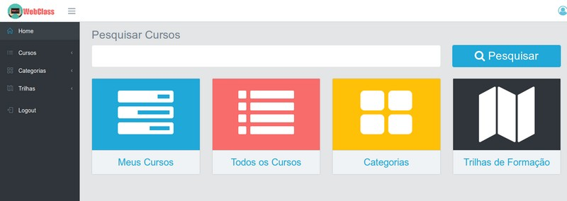

### Course Browsing

Students can browse all available courses organized by categories and trails.

**All Courses**

### Categories

Courses are organized into categories for easy discovery.

**Categories List**

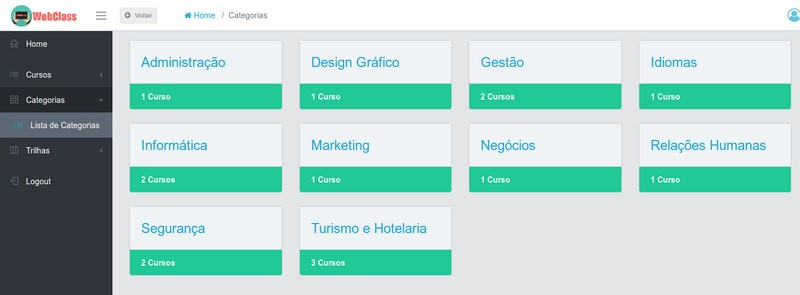

**Category View**

### Learning Trails

Learning trails group related courses into structured learning paths.

**Trails List**

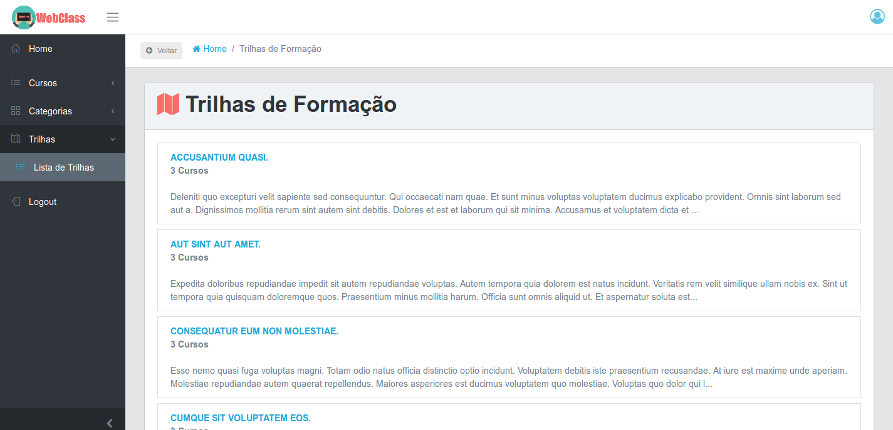

**Trail Details**

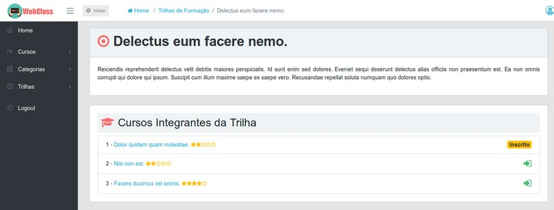

### My Courses

Students can view and manage their enrolled courses.

**My Courses**

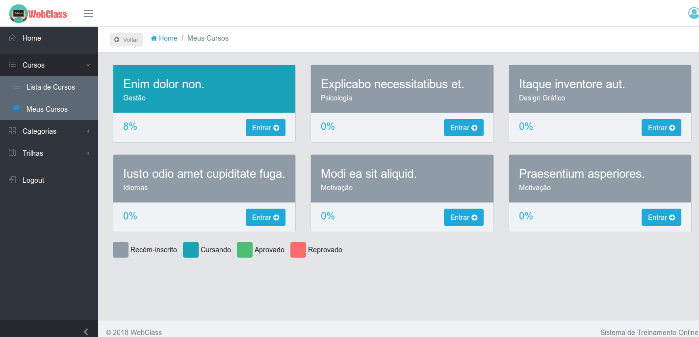

### Course States

The system tracks different course states for each student:

**Not Enrolled**

**Recently Enrolled**

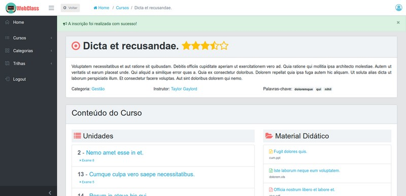

**Approved**

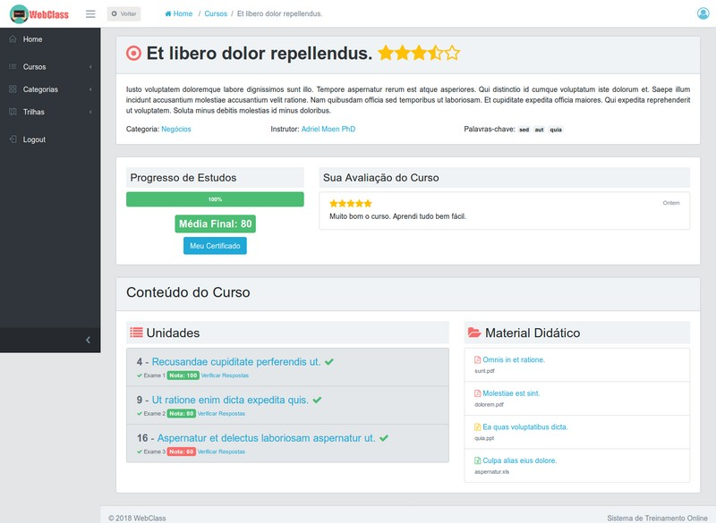

**Failed**

### Video Lessons

Students can watch video lessons integrated with YouTube.

**Watching Video Lesson**

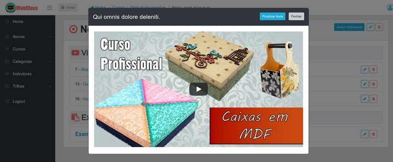

### Unit Completion

Track progress as units are completed.

**Completed Unit**

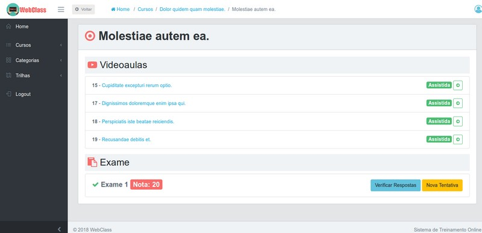

### Examinations

Students take examinations to assess their learning.

**Examination Verification**

### Ratings and Reviews

Students can rate and review courses.

**Course Ratings**

### Instructors

View instructor profiles and their courses.

**Instructors List**

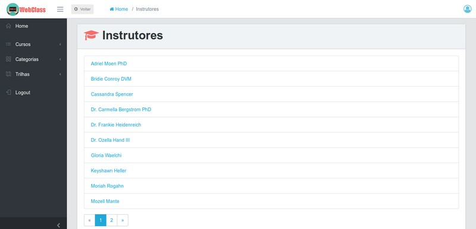

**Instructor Profile**

### User Profile

Students can manage their profile and change password.

**User Menu**

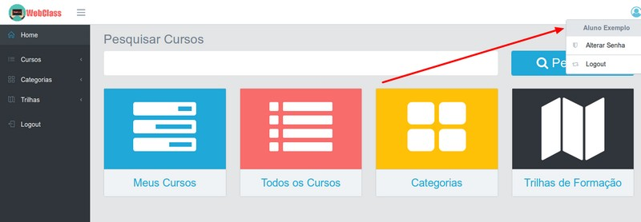

**Change Password**

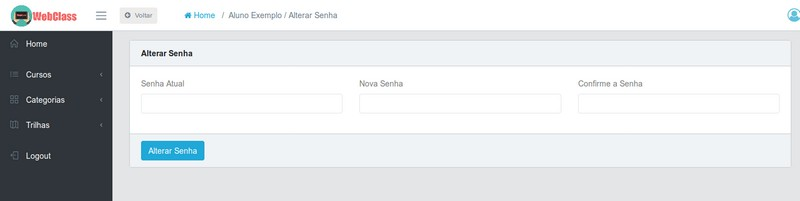

---

## Admin Environment

The admin environment provides comprehensive tools for managing all aspects of the learning platform.

### Dashboard

The admin dashboard provides an overview of the system.

**Admin Home**

### Course Management

Administrators can create and manage courses with detailed information.

**Course List**

**Create New Course**

**Edit Course**

**Course Details**

### Category Management

Organize courses into categories.

**Categories List**

**Create Category**

**Edit Category**

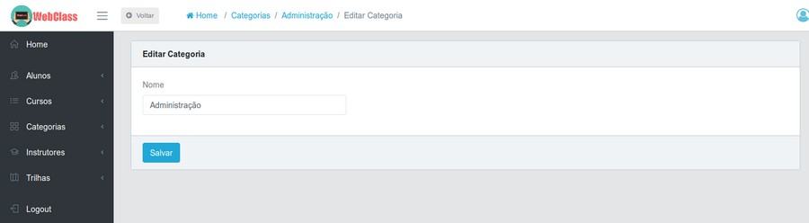

**Category View**

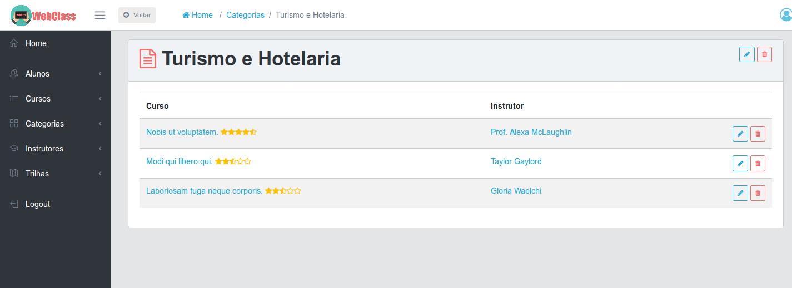

### Trail Management

Create learning trails to group related courses.

**Trails List**

**Create Trail**

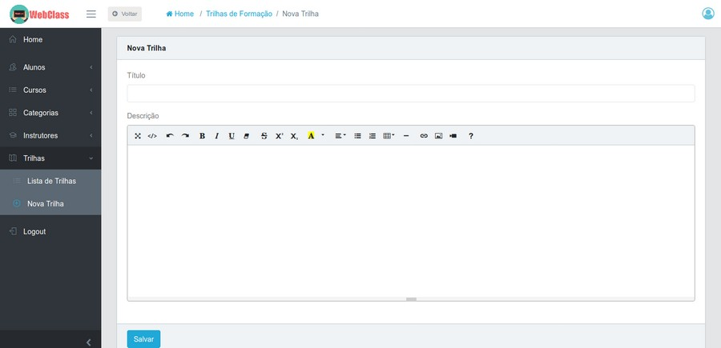

**Edit Trail**

**Trail Details**

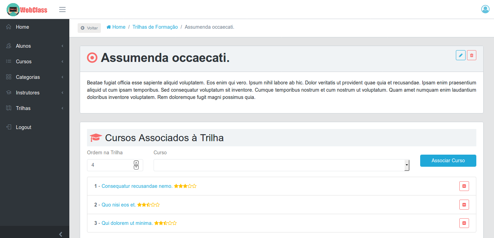

### Instructor Management

Manage instructor profiles and assignments.

**Create Instructor**

**Edit Instructor**

**Instructors List**

**Instructor Profile**

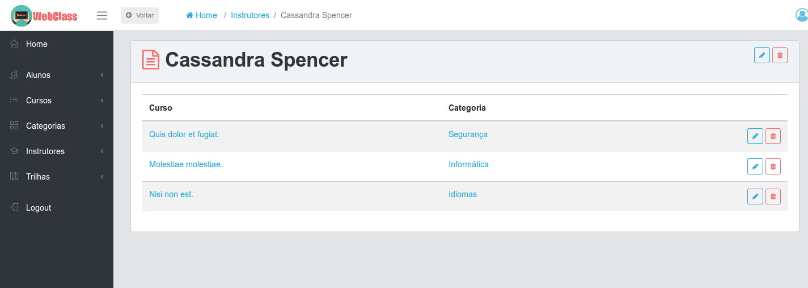

### Student Management

Manage student accounts and track progress.

**Students List**

**Create Student**

**Edit Student**

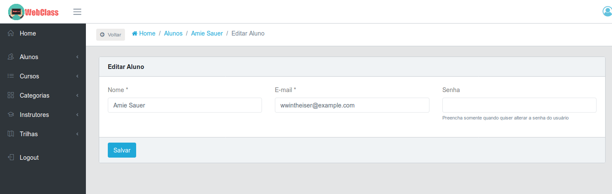

**Student Report**

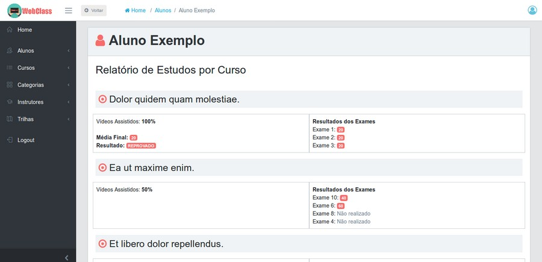

### Content Management - Units

Organize course content into units.

**Unit View**

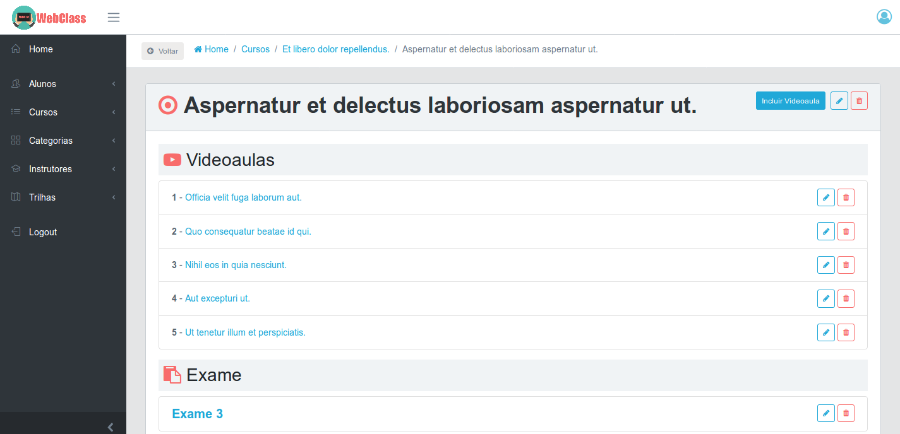

**Unit Without Exam**

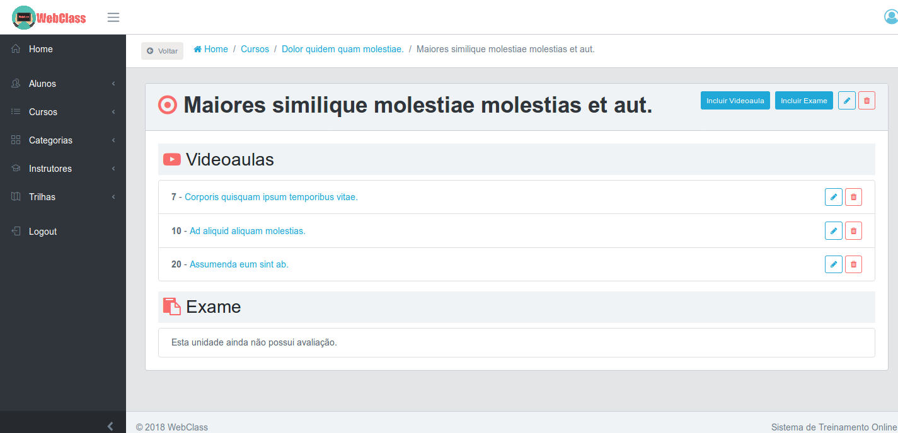

**Create Unit**

**Edit Unit**

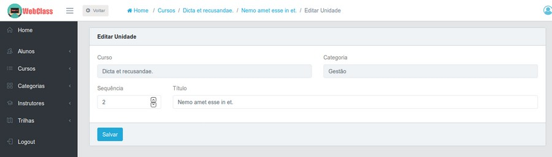

### Content Management - Video Lessons

Add video lessons to units.

**Create Video Lesson**

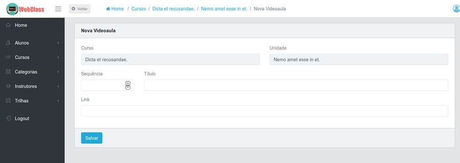

**Edit Video Lesson**

**Watch Video Lesson**

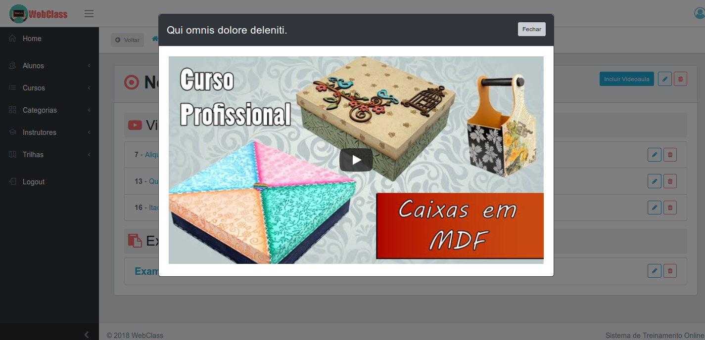

### Content Management - Course Materials

Upload and manage course materials (PDFs, documents).

**Create Courseware**

**Edit Courseware**

### Examination Management

Create and manage examinations for units.

**Exam Overview**

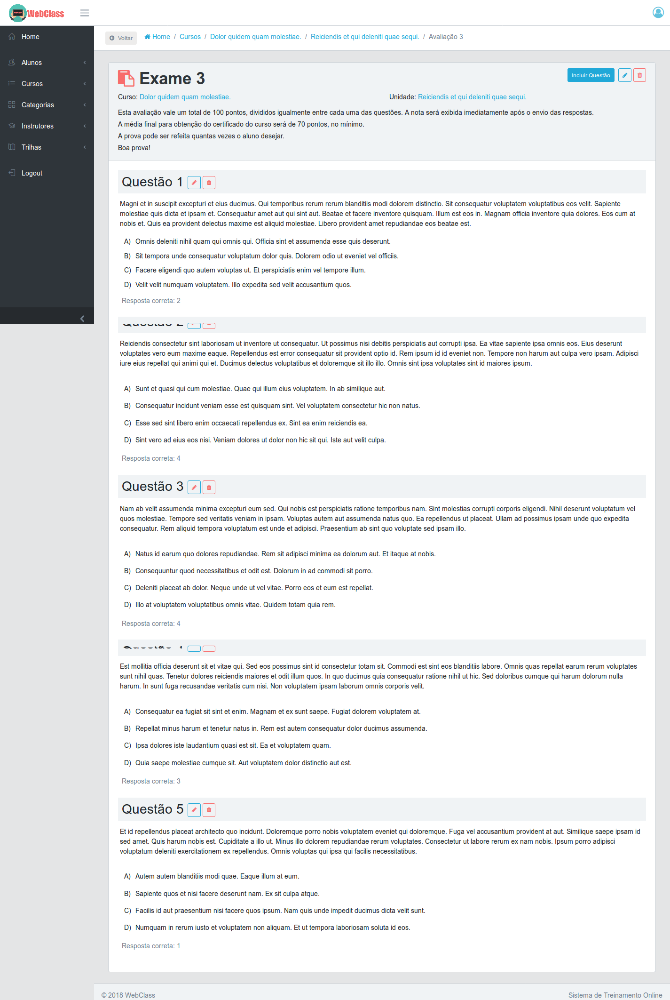

**Create Exam**

**Edit Exam**

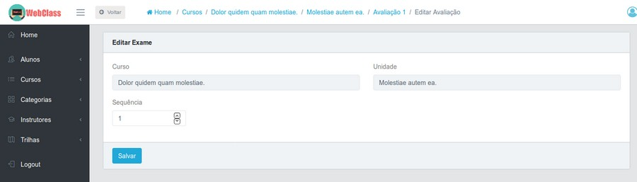

**Initial Exam**

**Final Exam**

### Question Management

Create multiple-choice questions for examinations.

**Create Question**

**Edit Question**

### Ratings Management

View and manage course ratings from students.

**Course Ratings**

### User Management

Manage user accounts and permissions.

**User Menu**

**Password Recovery**

**New Password**

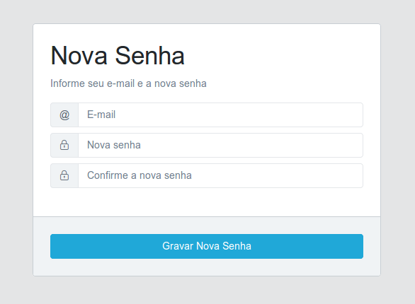

**Login**

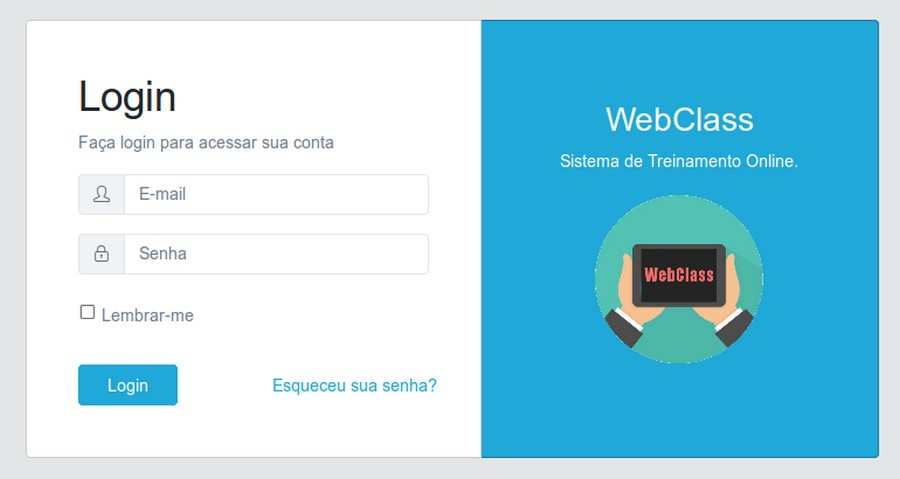

---

## Key Features Summary

### For Students
✅ Browse courses by category or learning trail  
✅ Enroll in courses  
✅ Watch video lessons (YouTube integration)  
✅ Download course materials  
✅ Take initial and final examinations  
✅ Track learning progress  
✅ Obtain completion certificates (PDF)  
✅ Rate and review courses  
✅ Manage profile and password  

### For Administrators
✅ Complete course management (CRUD)  
✅ Category and trail organization  
✅ Instructor management  
✅ Student management and reporting  
✅ Content creation (units, lessons, materials)  
✅ Examination and question management  
✅ Rating and feedback management  
✅ User authentication and authorization  
✅ PDF certificate generation  

---

## Technology Stack

- **Backend**: Laravel 5.5 (PHP 7+)
- **Database**: MySQL
- **Frontend**: HTML5, CSS3, JavaScript, Bootstrap
- **Video Integration**: YouTube
- **PDF Generation**: DomPDF
- **Security**: HTMLPurifier for content sanitization

---

## Conclusion

WebClass provides a complete, professional solution for online course management. With its dual-environment architecture, it serves both learners seeking knowledge and administrators managing educational content effectively.

For installation and setup instructions, please refer to the [README.md](README.md) file.
